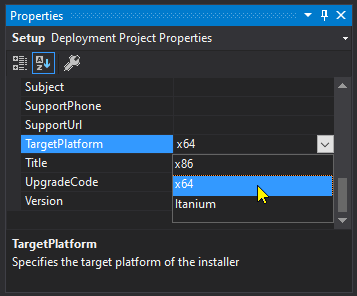

# OneMore Reference

## Online References

* [OneNote Developer Reference Overview 2013](https://docs.microsoft.com/en-us/office/client-developer/onenote/onenote-developer-reference)
* [OneNote Application Interface, API Reference](https://docs.microsoft.com/en-us/office/client-developer/onenote/application-interface-onenote)
* [Office File Formats and PDF downloads](https://msdn.microsoft.com/en-us/library/cc313105(v=office.12).aspx)
* [Adding Custom Galleries to the 2007 Office Fluent User Interface (2007)](https://msdn.microsoft.com/en-us/library/bb736142%28v=office.12%29.aspx?f=255&MSPPError=-2147217396)
* [Creating Custom Ribbon Galleries in Microsoft Excel 2007](https://msdn.microsoft.com/en-us/library/office/dd756403%28v=office.12%29.aspx?f=255&MSPPError=-2147217396)
* [Custom UI Ribbon XML Markup Specification](https://docs.microsoft.com/en-us/openspecs/office_standards/ms-customui/d842006e-3187-4f66-a17d-0819a3cc94b5)
* [imageMso List (PDF saved)](https://bert-toolkit.com/imagemso-list.html)

Other Technical

* [Force Window as Top-Most](https://stackoverflow.com/questions/1309855/what-is-powerful-way-to-force-a-form-to-bring-front)
* [High DPI and auto-scaling toolstrips](https://stackoverflow.com/questions/42838120/how-to-proper-auto-scale-toolstrip-in-net)
* [Free Clipboard Viewer](https://www.freeclipboardviewer.com/)
* [Introduction to the Office 2010 Backstage View for Developers (PDF saved)](https://msdn.microsoft.com/en-us/library/ee691833.aspx?f=255&MSPPError=-2147217396#odc_Office2010Introduction2OutSpaceUI_DescriptionsAttributesChildInformation)

## Adding a New Command

1. Add a new class file to the Commands folder. Name the class with a recognizable name such as
   TrimCommand and its file name should reflect the class name such as TrimCommand.cs.
1. The class should derive from the Command class and be marked _internal_
1. The class should have a public constructor
1. The class should have a public entry point method such as Execute()
1. Add a new method to the AddinCommands.cs file to invoke the command, giving it a similar name
   replacing Command with Cmd, such as TrimCmd and implemented as shown here:

		public void TrimCmd(IRibbonControl control)
		{
			factory.GetCommand<TrimCommand>().Execute();
		}

1. If the command needs a test to determine whether it should be enabled, use one of the existing
   enablers or add one to the AddInsEnablers.cs file.
1. Add a button control to the Properties\Ribbon.xml file
   a. Specify a unique id and label property
   a. Choose an appropriate imageMso name from [imageMso List (PDF saved)](https://bert-toolkit.com/imagemso-list.html)
   b. If an enabler is needed, specify the required one with a getEnabled property
   c. Set the onAction property to the &lt;name&gt;Cmd method added to AddIns.cs
   

## Rebuilding for 64-Bit OneNote

The Setup project is configured for a 32-Bit installation of OneNote. If you have a 64-bit version
then you should change the TargetPlatform property in the Setup project. _Note there is no need to
change the bitness of the OneMore project itself; leave it as AnyCPU._

Select the Setup project from the Visual Studio Solution Explorer and change the TargetPlatform
property x64 as shown here:

Rebuild the Setup project and away you go!

## A Note on Debugging OneMore

To start the debugging, add this to the code where you want to start the debugger:

	System.Diagnostics.Debugger.Launch();

This will cause Visual Studio to launch the _attach debugger_ dialog. This is most useful
when you already have the OneMore solution open in Visual Studio so you can attach using
that VS instance with all of the source code and symbols ready to go.

If the attach debugging dialog does not appear and instead a new instance of VS is opened then 
[check this out from Microsoft about the Just in Time Debugger settings](https://docs.microsoft.com/en-us/visualstudio/debugger/debug-using-the-just-in-time-debugger).

#### Enable Add-in UI Error Notifiaction

1. Open OneNote
2. Click File.. Options.. Advanced
3. At bottom of page, enable the checkbox _Show add-in user interface errors_

#### Development Environment

The OneMore installer deploys files under %ProgramFiles(x86)\River\OneMore and registers the
addin in the Registry by pointing to that folder. But the VS project has its own local bin folder
which makes quick development cumbersome if you need to continually copy DLLs to that deployment
folder after every build.

You can avoid that by manually altering the Registry setting to point to the project bin folder
using something like this .reg file:

	Windows Registry Editor Version 5.00
	[HKEY_CLASSES_ROOT\WOW6432Node\CLSID\{88AB88AB-CDFB-4C68-9C3A-F10B75A5BC61}\InprocServer32]
	"CodeBase"="C:\\River\\OneMore\\OneMore\\OneMoreAddIn\\bin\\x86\\Debug\\River.OneMoreAddIn.dll"

##### Other Registry Locations

	HKEY_CURRENT_USER\SOFTWARE\Microsoft\Office\16.0\OneNote (Load Times)
	HKEY_CURRENT_USER\SOFTWARE\Microsoft\Office\OneNote (LoadBehavior)
	HKEY_LOCAL_MACHINE\SOFTWARE\WOW6432Node\Microsoft\Office\OneNote (LoadBehavior)

_Primary Registry path for Regedit:_

	Computer\HKEY_CLASSES_ROOT\WOW6432Node\CLSID\{88AB88AB-CDFB-4C68-9C3A-F10B75A5BC61}\InprocServer32

##### EnabledLogging.reg (doesn't actually work :-(

	Windows Registry Editor Version 5.00

	[HKEY_CURRENT_USER\SOFTWARE\Microsoft\Office\16.0\OneNote\Options\Logging]
	"EnableLogging"=dword:00000001
	"EnableTextFileLogging"=dword:00000001
	"ttidLogObjectModel"=dword:00000001
	"ttidLogObjectModelAddins"=dword:00000001
	"ttidLogIncludeTimeDateStamp"=dword:00000001
	"ttidLogMerge"=dword:00000001
	"ttidLogReplicationConcise"=dword:00000001
	"ttidLogCellStorageClientRequests"=dword:00000000
	"ttidLogNativeReplicator"=dword:00000000
	"ttidLogNotebookDiff"=dword:00000000
	"ttidLogObjectSpaceStoreCell"=dword:00000000
	"ttidLogReplicationScheduler"=dword:00000000
	"ttidLogServerFolderReplicator"=dword:00000000
	"ttidLogSharePointAndWebDAV"=dword:00000000
	"ttidLogEditorsTable"=dword:00000000
	"ttidLogSkyDrive"=dword:00000000
	"ttidLogMultiRoundTripSuspend"=dword:00000000

