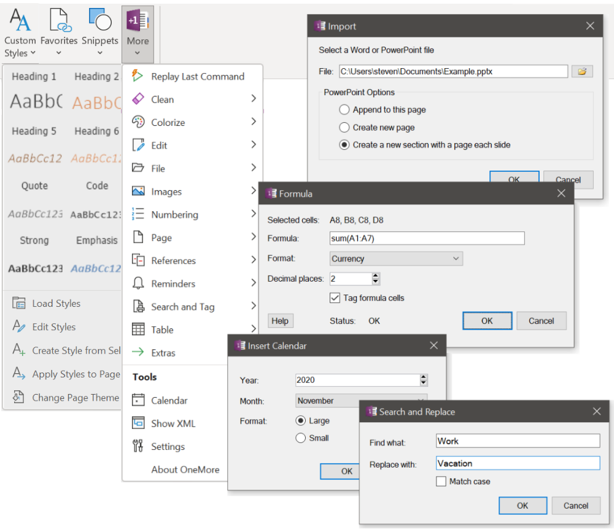
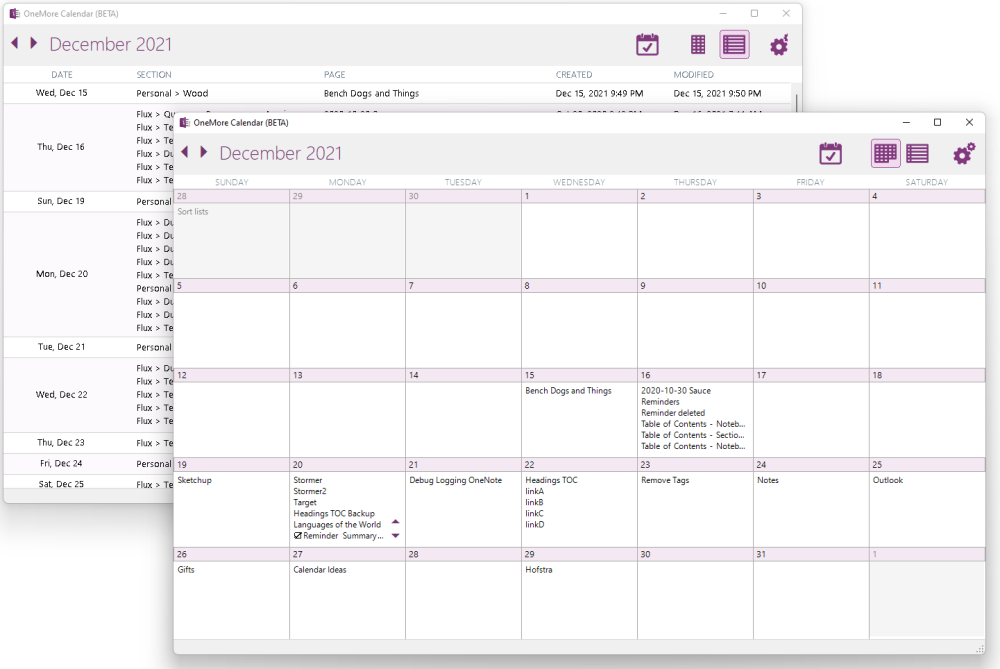

#  OneMore - a OneNote Add-in

OneMore is an add-in for OneNote with simple and powerful features that make OneNote a better OneNote.

* Download the [latest release](https://github.com/stevencohn/OneMore/releases/latest)
* Read the [installation instructions](https://onemoreaddin.com/get-started/How%20to%20Install%20OneMore.htm)
* See the new [OneNote Wiki](https://onemoreaddin.com/) for a full user guide

#      

# Highlights
- Quickly access all OneMore commands from the almighty [Command Palette](https://onemoreaddin.com/the-basics/Basics.htm)!
- Type and search for [inline #hashtags](https://onemoreaddin.com/commands/Search%20and%20Tag%20Commands.htm)
- Use the [Navigator window](https://onemoreaddin.com/the-basics/Navigator.htm) to keep track of visited pages, a personalized reading list, and navigate the headings of the current page.
- Integrating with the [ribbon bar](https://onemoreaddin.com/the-basics/Basics.htm), extends <a href="https://onemoreaddin.com/context-menus/Context%20Menu%20Extensions.htm">context menus</a>, and provides customized <a href="https://onemoreaddin.com/the-basics/OneNote%20Keyboard%20Shortcuts.htm">keyboard shortcuts</a>
- Create [customized font styles](https://onemoreaddin.com/commands/My%20Styles%20Commands.htm) in addition to those provided by OneNote, apply a style to selected text, or apply all styles to the entire page
- Use predefined [table styles](https://onemoreaddin.com/commands/Table%20Style%20Commands.htm) or create your own to selectively set cell background and fonts
- Manage a collection of [favorite pages and sections](https://onemoreaddin.com/commands/Favorites%20Commands.htm) with shortcuts to quickly jump to a favorite
- Add [colorized syntax highlighting](https://onemoreaddin.com/commands/Colorize%20Command.htm) to snippets of source code
- Add [formulas in table cells](https://onemoreaddin.com/commands/Table%20Commands.htm) using Excel-like expressions
- [Crop, rotate, or adjust images](https://onemoreaddin.com/commands/Image%20Commands.htm) on a page without opening an external photo editor
- Save and reuse [custom snippets](https://onemoreaddin.com/commands/Snippets%20Commands.htm) of content anywhere on any page
- - And many, many more… see below

## Screenshots

| Some of the OneMore menus | The OneMore Calendar |
|---|---|
|  |  |
_Click an image to enlarge_

## 💁 Features - Over 160 commands and growing!
*Want more from OneMore? OneMore has more...*

See the 📓 **[OneNote Wiki](https://onemoreaddin.com/)** for a full user guide, setup instructions,
and description of each command.

© 2020 Steven M Cohn. All rights reserved.
