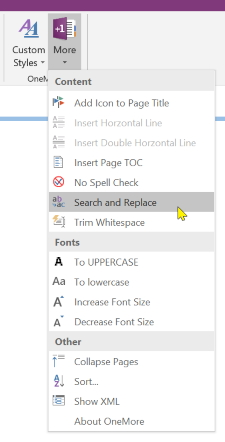
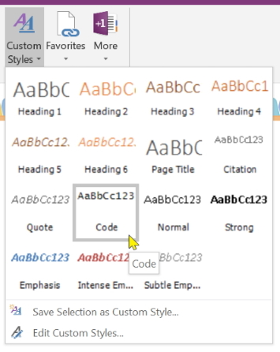
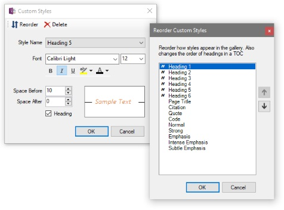
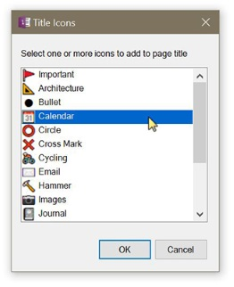

#  OneMore - a OneNote Add-in

A OneNote add-in with these features:

* Add icon to page title, also appears in page hierarchy
* Create/edit/apply custom styles
* Collapse the page hierarchy to see only top-level pages
* Change selected text to UPPERCASE
* Change selected text to lowercase
* Disable spell-check on the current page
* Insert single horizontal line
* Insert double horizontal line
* Insert Table of Contents including all headers on page
* Increase/Decrease the font size of all content in the current page
* Search and replace text on the current page
* View and edit page XML (a diagnostic, debugging, advanced-user tool)

All commands are accessed by two new buttons added to the main ribbon bar.

**Prerequisites**

* Developed for Windows 10
* Microsoft Visual Studio 2017, C#
* .NET Framework 4.6.1
* Microsoft OneNote 2016 32-bit

---

**OneMore Command Menu**

**Custom Styles**

**Custom Styles Dialog**

**Title Icons Dialog**

**XML Dialog**

