#  OneMore - a OneNote Add-in

A OneNote add-in with powerful yet simple and effective features including:

* Access all features from the [OneMore group menus](#menus) added to the Home ribbon
* Create/edit/apply [**custom styles**](#styles) with advanced options
* [Apply a style](#styles) to selected text or all custom styles to the current page with one click
* Manage menu of [**Favorites**](#favorites) for one-click link to your most referenced pages

*Want more from OneMore? OneMore has more...* Here's what's in the OneMore menu

General commands

* Disable **spell-check** on the current page (F4)
* [Paste Rich Text](#exCodeBox) (preserve colors when **pasting code** from Visual Studio)1 (Ctrl+Alt+V)
* [**Search and replace**](#other) text on the current page (Ctrl+H)
* Change selected text to UPPERCASE or lowercase
* Increase/Decrease the font size of all content on the current page
* Collapse the page hierarchy to see only top-level pages
* [Sort pages, sections, or notebooks](#other)
* View and edit the [internal OneNote XML](#xml) of the current page
* Change [**page background**](#dark) to any custom color with dark-mode awareness
* Save the current page as HTML or as OneNote native XML
* Check for updates and install upgrades on-demand

Clean commands

* Remove author/citation information from paragraphs
* Remove empty headers and "extra" empty lines between paragraphs
* Remove spacing between paragraphs and headings
* Show/Hide the page date and time stamps under the title
* Trim trailing whitespace from selected text

Formula commands

* [Calculate formulas](#formulas) in tables such as Sum, Average, Min, Max, and StdDev
* Delete formula from selected table cells
* Highlight cells with custom formulas
* Recalculate custom formulas in all tables on the page

Image commands

* Add [caption to a selected image](#images)
* Precisely [crop a selected image](#images)
* [Resize a selected image](#images) or all images on the page

Numbering commands

* Number all sections in the current notebook
* Number all pages in the current section with numeric or alpha-numeric prefixes
* Remove numbering from sections
* Remove numbering from pages

Snippets commands

* Insert single or double horizontal line
* Insert [**Table of Contents**](#exTOC) including all headers on page
* Insert [Info/Warn boxes](#exInfoBoxes) similar to Confluence Info and Warn macros
* Insert [Code box](#exCodeBox) similar to Confluence Code macro
* Insert [collapsable sections](#expand) to hide secondary or sensitive information
* Insert [status labels](#exStatusLabels) similar to the Confluence status macro

Extra commands

* Add [special icon to the page title](#other), also appears in page hierarchy
* Add or remove [**footnotes**](#footnotes) (endnotes)
* Insert pronunciation of words from over a dozen languages
* Merge pages, preserving formatting and position of outlines
* [Number page headings](#outlining) numeric or alpha-numeric outline prefixes
* [Indent content](#indenting) below headings or tagged paragraphs
* [Replace hyperlinked URLs](#nameUrls) with their Web page titles
* Toggle strikethrough text next to all completed/incompleted tags

#### Key Bindings
While all commands can be accessed from the OneMore ribbon group menus, some
commands also have their own key bindings:

| Command                       | Key Binding |
| ----------------------------- | ----------- |
| Add footnote                  | Ctrl + Alt + F
| Remove footnote               | Ctrl + Shift + F
| Insert horizontal line        | Shift + Alt + Minus
| Insert double horizontal line | Shift + Alt + Equals
| No Spell Check                | F4
| Paste Rich Text               | Ctrl + Alt + V
| Search and Replace            | Ctrl + H
| To uppercase                  | Ctrl + Shift + Alt + U
| To lowercase                  | Ctrl + Shift + U
| Increase font size            | Cltr + Alt + Plus
| Decrease font size            | Ctrl + Alt + Minus
| Show XML                      | Ctrl + Shift + Alt + X

**Why?**

For myself. I wanted something more than what OneNote provided. I was overwhelmed by _OneNote Gem_,
aghast at its bloated useless overloads of what was already otherwise available or features that
I would never use in a million years - and, oh yeah, that price! I admit I was intrigued by the
_Onetastic Macro_ approach but thought it limited and obtuse, decipherable only by programmers.
And both of these charge money for something that should be open source and neither provided exactly
what I wanted. So I did what any self respecting software engineer would do... I built my own.
Deal with it.

**Minimum Prerequisites**

* Developed for Windows 10
* Microsoft Visual Studio 2019, C# 7
* Microsoft Visual Studio 2019 Installer Projects extension
* .NET Framework 4.8
* Microsoft OneNote 2016 32-bit or 64-bit

Tested recently with Windows 10 2004 (19041.450), VS2019, and OneNote 2019/O365

---

## Examples of What OneMore Can Do...

### Table of Contents

Generate a Table of Contents based on both standard headings and custom user-defined headings
where each line is hyperlinked to its heading and indented according to its heading level.
Text colors are based on the page background color.

**Table of Contents** 
[Heading 1](#exampToc) 
. . [Heading 2](#exampToc) 
. . . . [Heading 3](#exampToc)

### Collapsable Sections

Insert a collapsable section at the current position on the page. This can be used to hide
secondary or sensitive information on your page. This snippet includes a single-cell table
to which you can add content.

### Status Labels

Insert colored status labels similar to the Status macros found in Confluence. These
are not as smart as the Confluence macros but instead are just simple text with a highlight
background that are fully editable inline.

### Information and Warning Boxes

Insert an information box or warning box with fully customizable headers and content.
These snippets are actually just nested tables. Text colors are based on the [page background
color](#dark).

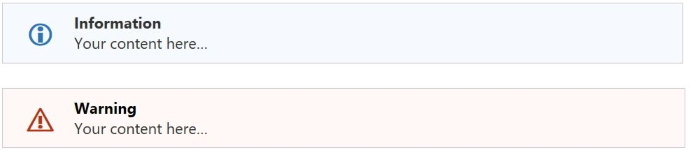

### Code Box

Insert a code box with heading and area for your code. Use the Paste Rich Text command
to paste syntax-highlighted code directly from Visual Studio1.
Text colors are based on the page background color.

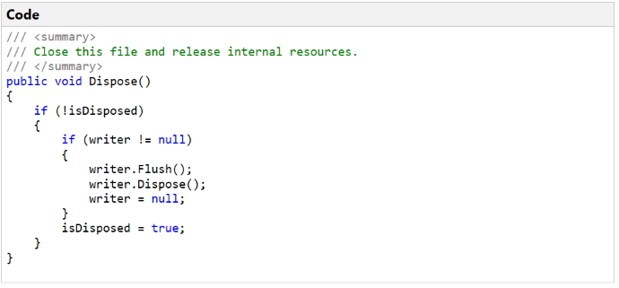

1 If text copied from Visual Studio is pasted as plain text instead of rich text
when using the Paste Rich Text command (Ctrl+Alt+V) then look at the VS Tools... Options...
Text Editor... Advanced, and tick the box *Copy rich text on copy/cut*.

### Images
The Add Caption command will add a caption to the selected image by moving the image
into a one-row, one-column table and centering the word "Caption" below the image, which of
course you should edit immediately. If your custom styles has a style named exactly "Caption"
then that style will be applied, otherwise, a default caption style is used.

The Crop command opens an image editing window that allows you to precisely crop and image
by selecting a region, moving that region around the image, and even resizing the region.

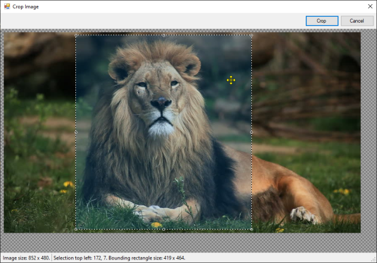

The Resize command can be used to resize images on the page. If one image is selected then
you can resize by percentage, absolute size, or to a preset width with aspect ratio maintained.
If more than one image is selected, or no images are selected, then you can resize them all to
a preset width. The preset width is saved so you don't need to keep entering it if you have a
width you typically use.

### Number Headings

OneNote doesn't offer to number headings like Word does but OneMore can apply numbers to
headings after headings are in place. From the Outline Formatting dialog's Numbering section,
choose to apply numeric or alphanumeric numbering to all headings on the page. Note that this
is a one-time procedure so if you add new or delete old headings, re-apply numbering using
this dialog. The _Remove existing_ checkbox cleans up numbering that you've applied below;
remember to tick this if you've already applied numbering, otherwise it will double-up!

The numeric numbering will prefix headings with "1.", "1.1.", "1.1.1.", etc. The alphanumeric
numbering will prefix headings with "1.", "a.", "i.", etc.

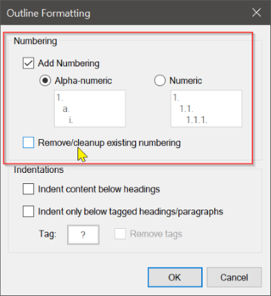

### Indenting Content

OneMore makes it easy to indent paragraphs below all headings, below tagged headings, or
below tagged paragraphs. If you want to indent only below tagged headings or paragraphs,
take advantage of OneNote's tagging-by-keyboard feature by customizing a tag and moving it
up to one of the first eight items in the list of tags; then you can use Ctrl-# to quickly
apply tags to the headings or paragraphs you want before using the Outline Formatting dialog.

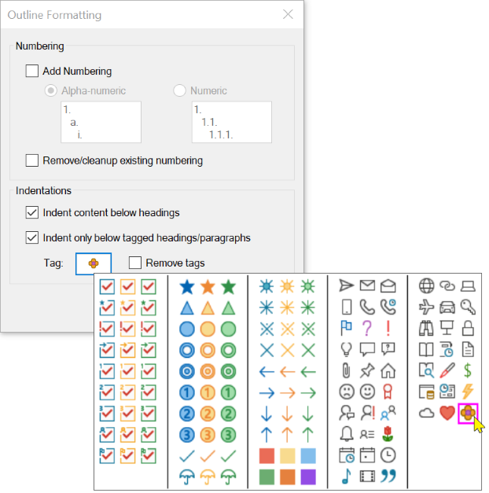

### Replace Hyperlinked URLs with Web Page Titles

Automatically replaces all or selected hyperlinked URLs with the &lt;title> specified on the 
associated Web pages. This only affects URLs for which the displayed text is the same as the
link address, meaning if you've already customized the dispalyed text, OneMore will not alter
your changes.

For example, given this URL on a OneNote page: [https://github.com/](https://github.com/)

it would be replaced with its hyperlinked title: [GitHub](https://github.com)

### Footnotes

Adding footnotes to a OneNote page seems somehow redundant but consider how often OneNote
is used for research and then used to copy/paste content into Word or print as PDF... yeah,
you get it then.

You can add a footnote anywhere on the page and a reference label is inserted at the current
cursor location and a footnote is added to the bottom of the page. You can then edit the
text in that footnote to your heart's desire. Text colors are based on the page background color.

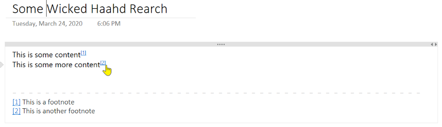

Note that footenotes are hyperlinked so you jump from the content body down to the text
of a footnote or back up again to the content that references a particular footnote.

And if you no longer want a footnote, place the cursor over the label or over the foonote
text at the bottom of the page and click the *Remove footnote* command. Voila!

OneMore keeps track of footnotes and will automatically reorder them to keep them numbered
sequentially from the top of the page. If you delete a footnote, it again will renumber
the remaining footnotes so there are no gaps. Pretty slick, huh?

### Office Black Theme and Custom Page Background

By default, OneNote lets you select from a light, pastel pallet for page backgrounds but it
if you change the Office theme to _Black_ then it does a fairly decent job of colorizing your
content and the OneMore custom styles work just fine. 

But if you don't want to affect all Office products then OneMore offers true dark-mode background
capabilities as well as custom page color selections. And OneMore comes with a style theme named
DarkStyles.xml that you can load.

_Please see the pinned "Known Issues" item in the Issues area for an explanation of why
colors might not look right when switching to a dark background._

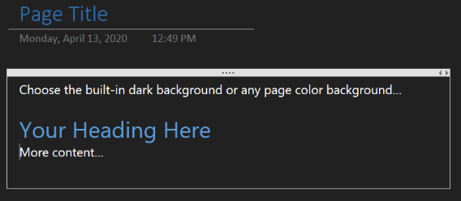

If you've selected a darker page background color, OneMore will generate the information box,
warning box, and code box with darker colors as well, such as:

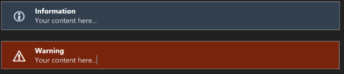

### What OneMore Doesn't Do

OneMore doesn't apply syntax highlighting to source code. If you really want that then
check out [OneNoteHighlight2016](https://github.com/elvirbrk/NoteHighlight2016) which seems
to be a fanstastic solution. However, if you're a Visual Studio developer OneMore already
knows how to paste rich text into OneNote, preserving all syntax highlighting. So why
install two addins when you only need one?

---
## Screenshots

#### OneMore Command Menus

The command menus are where you'll find all the features offered by OneMore. It's a simple
and quick way to access powerful enhancements to OneNote.

| Main and advanced features | Main and Snippets menus |
| -------------------------- | ----------------------- |
| 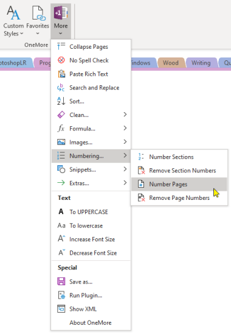 | 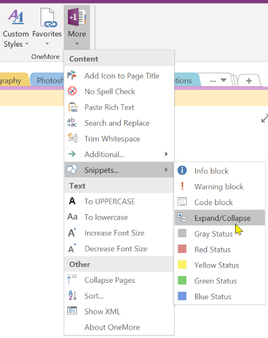 |

#### Custom Styles Gallery and Editor

The Custom Styles gallery and Editor provide an easy way to create new styles from scratch
or from the currently selected text, modify those styles and save them for later use. You
can then either apply a single style to selected text by choosing a style from the gallery
or use the *Apply Custom Styles to Page* command to apply all custom styles to the entire
page, looking for headers, citations, quotes, code, and normal text.

| Styles Gallery | Styles Editor |
| -------------- | ------------- |
| 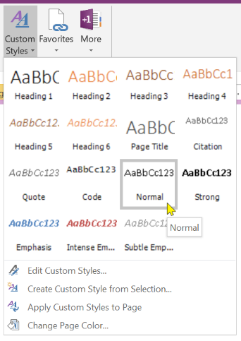 | 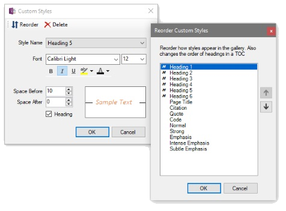 |

#### Favorites Menu

Although OneNote has multiple slick ways of navigating around notebooks, sections, and pages,
the most obvious feature missing is a Favorites menu. Well, you now have one with OneMore.
Simply click *Add current page* to add a new favorite. Click the flyout menu to delete an
indvidual favorites. Easy.

| Favorites Menu |
| -------------- |
| 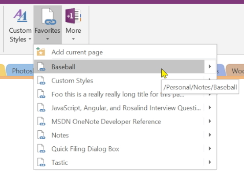 |

#### Formulas

While you can insert an Excel table on a OneNote page, for simple calculations, OneMore offers
a Formula menu that can apply formula to selected cells and calculate across rows or columns.

First, select the cell or cells into which you want to add a formula. If multiple cells are
selected, they must either be on the same row or in the same column. Then select the Add
Formula command. The Formula dialog is displayed. Choose the direction, format, and function
and click OK.

The Recalculate command will recalculate all formulas in the selected table(s).

The Highlight command will select all cells containing formulas so you know where you put them.

The Delete command will remove a formula from the selected cell(s) but retain the values displayed
in those cell.

| Formula Menu | Formula Dialog |
| ------------ | -------------- |
| 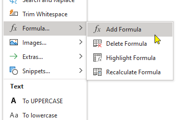 | 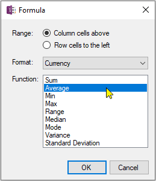 |

#### Other Screenshots

The *Search and Replace* command does exactly what you think. I can't believe Microsoft didn't
add this most basic editing feature by default. Worry no longer. Here it is. And you can enter
a regular expression in the _Find what_ field so you can really brag to your friends.

The *Add Title Icon* command lets you chose from a selection of icons from the Segoe UI Emoji
font to add to the page title; OneNote automatically displays that icon in the page
navigator as well.

The *Sort* command lets you sort notebooks, sections, or pages with advanced options
not found in any other plugin, even those bloated pay-to-use monstrosities.

| Search and Replace | Title Icons | Sort Notebooks, Sections, Pages |
| ------------------ | ----------- | ------------------------------- |
|  | 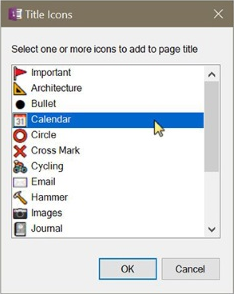 | 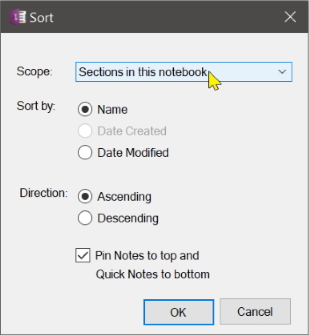 |

#### XML Dialog

Developing OneMore meant reverse-engineering the way Microsoft built OneNote. And it's XML
schema reference documentation was only half the picture. This editor became invaluable
while trying to decipher the behavior and how OneNote manages its page content.

| Page XML Editor |
| --------------- |
| 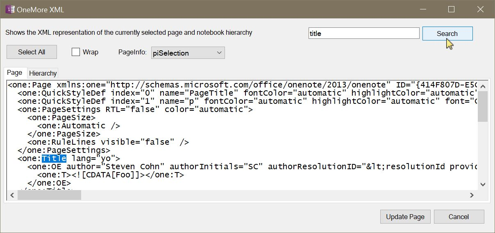 |

---

## Developing OneMore

See the [README file](OneMore/README.md) under the OneMore project folder for technical reference and information
regarding developing and debugging this OneNote add-in.

